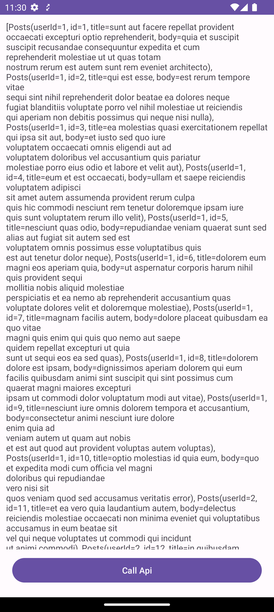
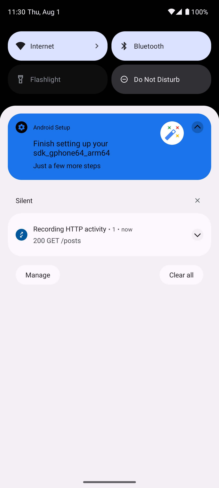
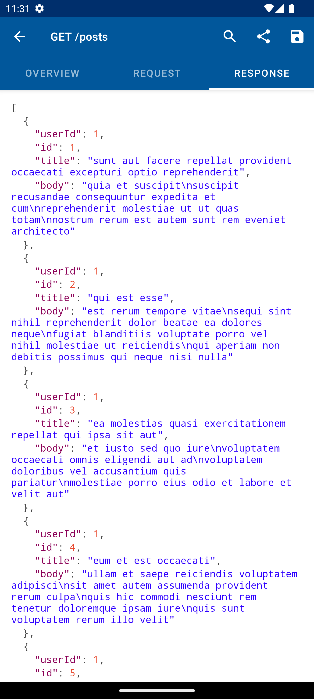

# ChuckerDemo

## Simple Api Call Request

## Chucker Notification

## Chucker Api Preview

## Contributing
Contributions are welcome! Please feel free to submit issues or pull requests.

## License
This project is licensed under the MIT License - see the [LICENSE](LICENSE) file for details.
